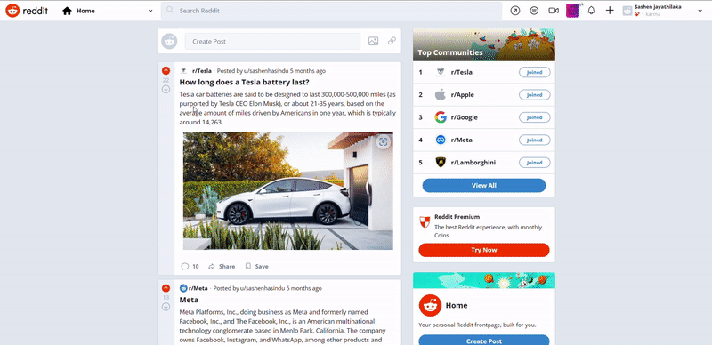

<div align="center">

  
  
  <h1>Vulnerable Reddit can you pwd?</h1>
  
  <p align="center" style="font-size: 1.2rem;">
  Reddit Clone is designed as a CTF challenge to help developers practice identifying, exploiting and mitigate common vulnerabilities in modern web applications. I intentionally included vulnerabilities such as XSS's, SSRF, SQL injection ,multiple IDORs, and file upload vulnerabilities. The goal is to offer a safe and controlled environment where security enthusiasts can hone their skills in a fun and challenging way. Despite these vulnerabilities, I utilize secure technologies such as Google Cloud, Next.js, Chakra UI, TypeScript, and Recoil. The platform allows users to create and join communities, upvote and downvote posts, and engage in real-time community chat and Dark Mode & Light Mode.
  </p>
  
</div>

<br />

<!-- Table of Contents -->

## :notebook_with_decorative_cover: Table of Contents

- [About the Project](#star2-about-the-project)
  - [Screenshots](#camera-screenshots)
  - [Tech Stack](#space_invader-tech-stack)
  - [Environment Variables](#key-environment-variables)
- [Getting Started](#toolbox-getting-started)
  - [Prerequisites](#bangbang-prerequisites)
  - [Run Locally](#running-run-locally)
  - [Deployment](#deployment)
- [Vulnerabilities](#Vulnerabilities)

<!-- About the Project -->

## :star2: About the Project

<!-- Screenshots -->

### :camera: Screenshots

- Create Community, Join Community, Leave Community, Upvote and Downvote Posts(you can only post in a community)

<div align="center">
<a href="https://reddit-breakit.vercel.app/"></a>
</div>

<br />

- User Profile Section
  
<div align="center">
<a href="https://reddit-breakit.vercel.app/"></a>
</div>

<br />
  
- Conversation Section (Reddit Clone Live Chat)
  
<div align="center">
<a href="https://reddit-breakit.vercel.app/"></a>
</div>

## <a href="https://reddit-breakit.vercel.app/" target="_blank">LIVE DEMO 💥</a>

### :space_invader: Tech Stack


  <summary>Client</summary>
  <ul>
    <li><a href="https://#/">Typescript</a></li>
    <li><a href="https://nextjs.org/">Next.js</a></li>
    <li><a href="https://reactjs.org/">React.js</a></li>
    <li><a href="https://chakra-ui.com/">Chakra UI</a></li>
  </ul>


<summary>Database</summary>
  <ul>
    <li><a href="https://firebase.google.com">Firebase</a></li>
  </ul>

  <summary>Functions</summary>
  <ul>
    <li><a href="https://firebase.google.com/docs/functions">Cloud Functions for Firebase</a></li>
  </ul>

<br />

<table>
    <tr>
        <td>
<a href="#"></a>
        </td>
                        <td>
<a href="#"></a>
        </td>
                        <td>
<a href="#"></a>
        </td>
                                <td>
<a href="#"></a>
        </td>
                                <td>
<a href="#"></a>
        </td>
                                      <td>
<a href="#"></a>
        </td>
    </tr>
</table>

## :toolbox: Getting Started

### :bangbang: Prerequisites

- Sign up for a Firebase account <a href='https://firebase.google.com'>HERE</a>
- Install Node JS in your computer <a href='https://nodejs.org/en/'>HERE</a>

<!-- Env Variables -->

### :key: Environment Variables

To run this project, you will need to add the following environment variables to your .env file

`NEXT_PUBLIC_FIREBASE_API_KEY`

`NEXT_PUBLIC_FIREBASE_AUTH_DOMAIN`

`NEXT_PUBLIC_FIREBASE_PROJECT_ID`

`NEXT_PUBLIC_FIREBASE_STORAGE_BUCKET`

`NEXT_PUBLIC_FIREBASE_MESSAGING_SET`

`NEXT_PUBLIC_FIREBASE_APP_ID`

`NEXT_PUBLIC_BASE_URL`


<!-- Run Locally -->

### :running: Run Locally


Clone the project

```bash
  git clone https://github.com/Am0stafa/Reddit-Clone.git
```

change directory

```bash
  cd Reddit-Clone
```

Install dependencies

```bash
  npm install
```
<a href="https://github.com/Am0stafa/Reddit-Clone/blob/main/package.json" target="_blank">🔶 Dependency Info</a>

Start the server

```bash
  npm run dev
```

Visit the app
```url
  http://localhost:3000
```

<hr />

<br>

#### Deployment


The easiest way to deploy your Next.js app is to use the [Vercel Platform](https://vercel.com/new?utm_medium=default-template&filter=next.js&utm_source=create-next-app&utm_campaign=create-next-app-readme) from the creators of Next.js.

Check out our [Next.js deployment documentation](https://nextjs.org/docs/deployment) for more details.
<br>
<br>

## Vulnerabilities


<details>
  <summary>Reflected XSS</summary>
  <ul>
    <li>
        <details>
            <summary>Solution</summary>
            <ul>
                <li>
                    there goes the solution
                </li>
            </ul>
        </details>
    </li>
    <li>
    <details>
        <summary>Hint</summary>
        <ul>
            <li>
                there goes the hit
            </li>
        </ul>
    </details>
</li>
  </ul>
</details>
<br>

<details>
  <summary>Stored XSS</summary>
  <ul>
    <li>
        <details>
            <summary>Solution</summary>
            <ul>
                <li>
                    there goes the solution
                </li>
            </ul>
        </details>
    </li>
    <li>
    <details>
        <summary>Hint</summary>
        <ul>
            <li>
                there goes the hit
            </li>
        </ul>
    </details>
</li>
  </ul>
</details>